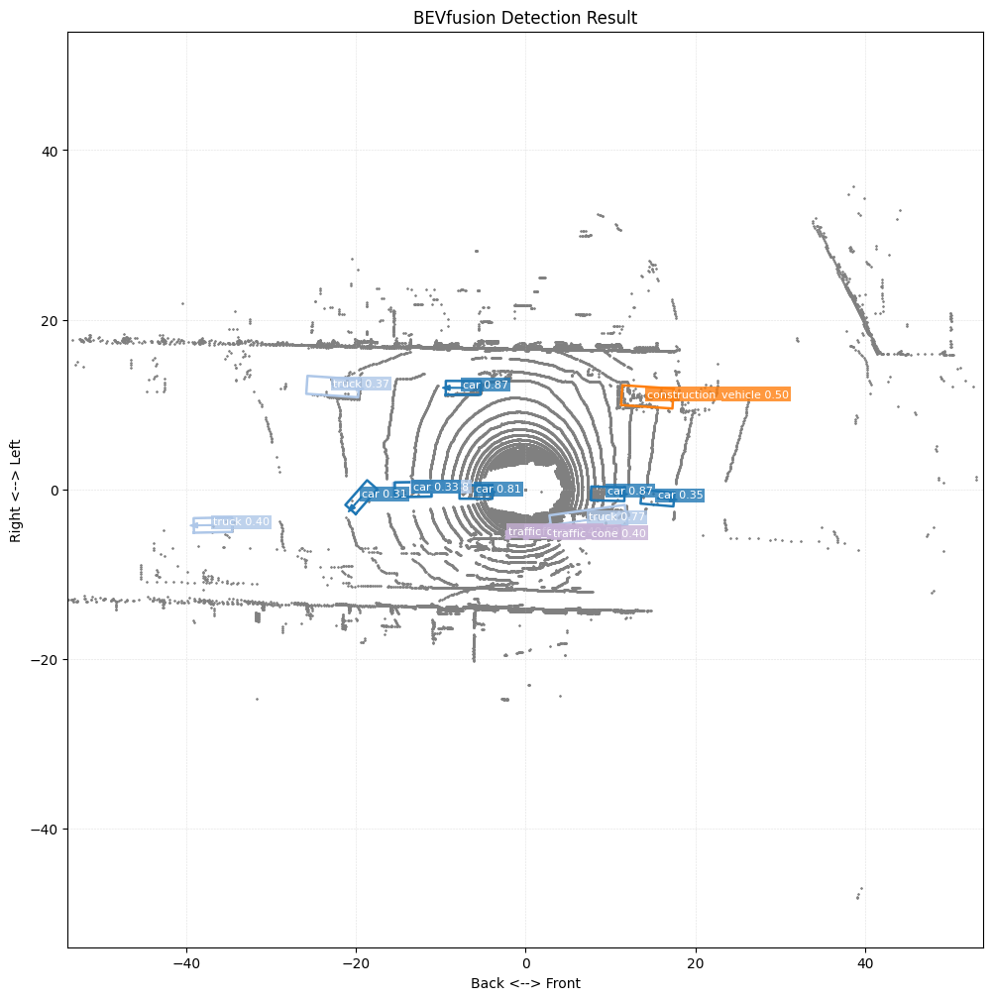
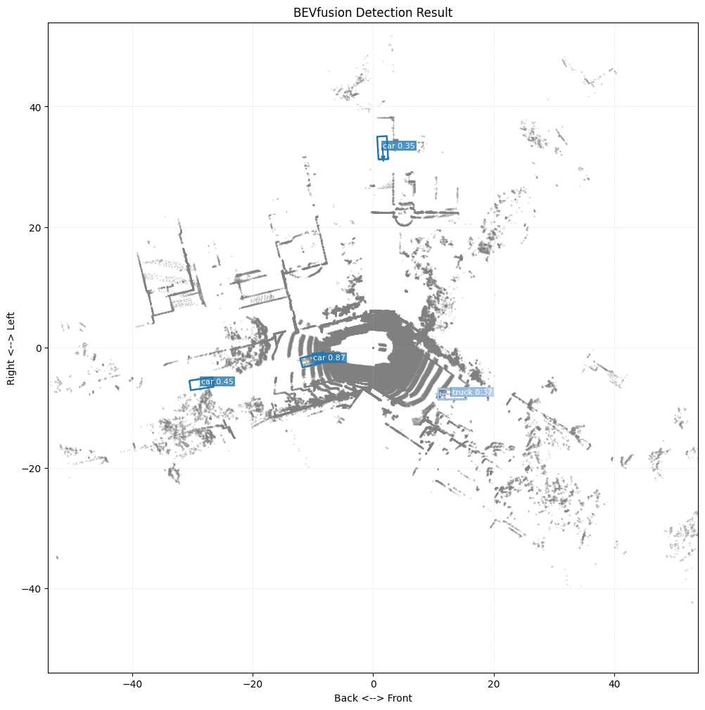
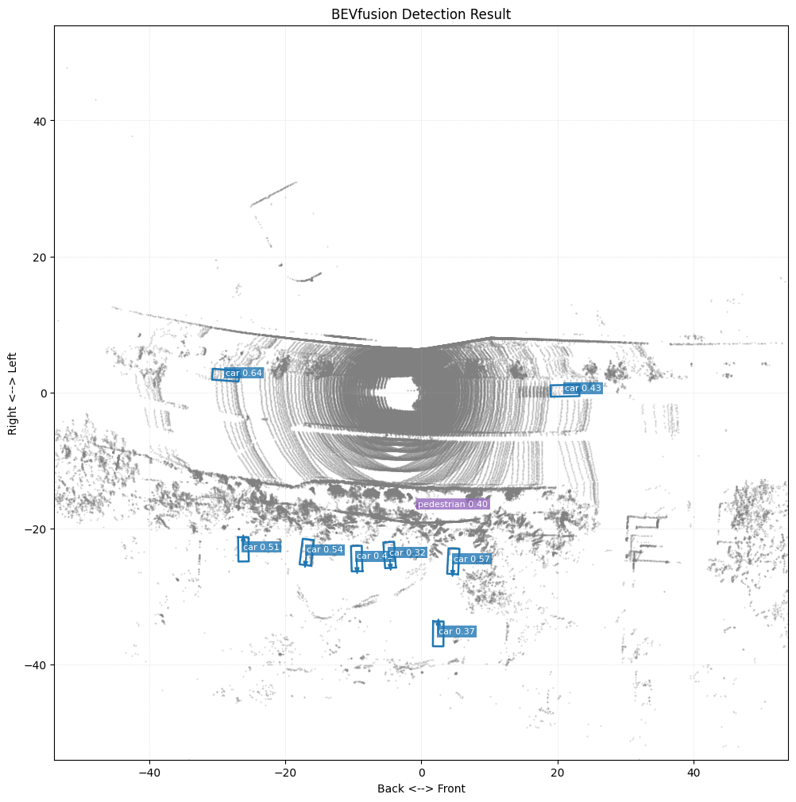
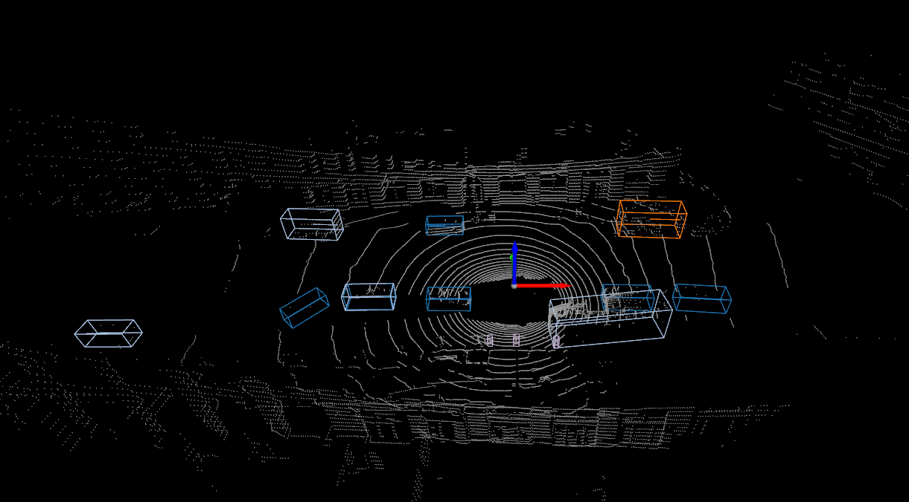
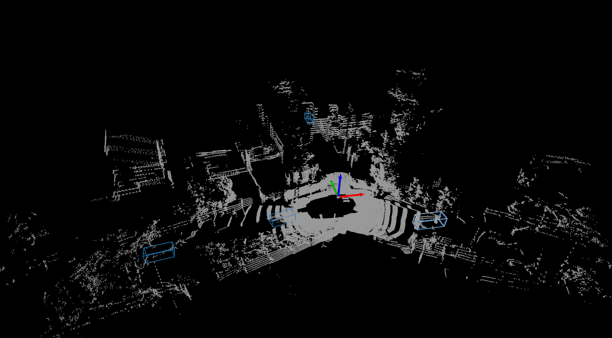
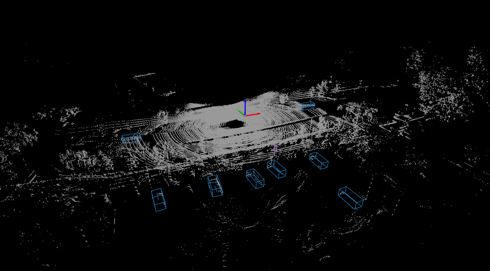

# BEVFusion-PyTorch

This is an **unofficial pure PyTorch implementation of BEVFusion**. For the original work, please read and cite the authors' paper: [BEVFusion: Multi-Task Multi-Sensor Fusion with Unified Bird's-Eye View Representation](https://arxiv.org/abs/2205.13542).

The original BEVFusion implementations (including the [official repo](https://github.com/mit-han-lab/bevfusion) and the [MMDetection3D repo](https://github.com/open-mmlab/mmdetection3d/tree/main/projects/BEVFusion)) depend heavily on [OpenMMLab libraries](https://github.com/open-mmlab). While these are excellent libraries for computer vision and detection, they have unfortunately not been updated for several years. This has led to conflicts with many of the latest dependencies.

I have written this pure PyTorch version based on their original code. This lightweight version is simple to use as a **BEV backbone to extract BEV features** (also including camera and LiDAR features) for downstream tasks.

## Requirments

### Option 1: Automatic Setup

For a quick environment setup, use these scripts to configure the environment based on CUDA 12.6.
```bash
bash ./scripts/setup_env.sh
bash ./scripts/setup_ops.sh
```

### Option 2: Manual Setup
You can create a new [Conda](https://docs.conda.io/en/latest/) environment named 'bevfusion_pytorch' with the following command.

```bash
conda create -n bevfusion_pytorch python=3.10
```

Then activate the environment and install the required libraries.
```bash
conda activate bevfusion_pytorch
```

Install [PyTorch](https://pytorch.org/get-started/locally/) based on your GPU.
```bash
pip install torch torchvision --index-url https://download.pytorch.org/whl/cu126
```

Install the remaining dependencies for the nuScenes dataset, spconv, and the ipynb kernel.
```bash
pip install nuscenes-devkit==1.2.0 matplotlib==3.9.4 spconv-cu126==2.3.8 ipykernel==7.2.0 ipywidgets==8.1.8
```

In addition, please run the following command to install the CUDA operations.
```
python3 setup.py develop
```

## Models

I followed the [MMDetection3D configuration](https://github.com/open-mmlab/mmdetection3d/blob/main/projects/BEVFusion/configs/bevfusion_lidar-cam_voxel0075_second_secfpn_8xb4-cyclic-20e_nus-3d.py) and utilized the [official pre-trained checkpoints](https://github.com/open-mmlab/mmdetection3d/tree/main/projects/BEVFusion#results-and-models). These weights are converted to match this PyTorch implementation architecture.

You can run the following script to handle the conversion.
```bash
bash ./scripts/convert_ckpt.sh
```
Alternatively, you can run the Python code directly.
```bash
python3 convert_ckpt.py
```
The process will automatically download the [original checkpoint](https://download.openmmlab.com/mmdetection3d/v1.1.0_models/bevfusion/bevfusion_lidar-cam_voxel0075_second_secfpn_8xb4-cyclic-20e_nus-3d-5239b1af.pth) and convert it to `bevfusion-pytorch.pth` inside the `checkpoints` folder.

## Demo

For a quick demo, please open `quick_demo.ipynb`. It provides five available demo indices including 0, 100, 200, 300, and 400.

If you use `demo.ipynb`, you must download the nuScenes dataset first. Ensure that `DATA_ROOT` is updated to the path where your dataset is stored.

**Note**: The nuScenes LiDAR coordinates must be converted to the MMDetection3D LiDAR coordinate system before being fed into the model. Please refer to the `demo.ipynb` code for implementation details.

* nuScenes Y (Forward) maps to MM X (Forward)
* nuScenes X (Right) maps to MM -Y (Left is positive)

The results should be identical to the original MMDetection3D version. Some examples are provided below as a reference.

<p align="center">
  
</p>

<p align="center">
  
</p>
